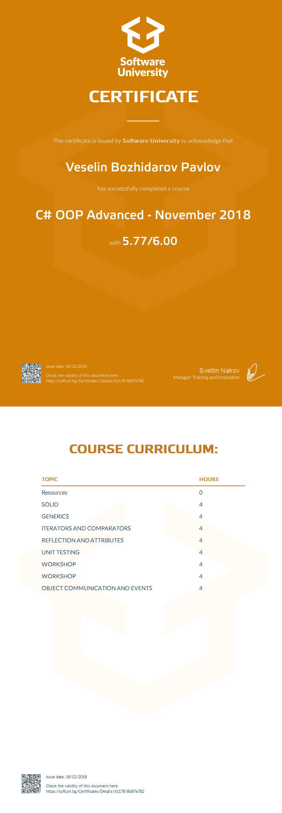

<a href="https://softuni.bg/trainings/courses" rel="Courses">  ![SoftUni logo][logo] <a/>

[logo]: http://innovationstarterbox.bg/wp-content/uploads/2016/05/Softuni_logo_trasparent.png "Logo Title Text 2"

---
In the Object Oriented Programming (OOP) course you will learn about the principles and best practices for building quality software. You will become familiar with the concepts of writing quality code in OOP in the C # language. This includes using abstractions, refactoring, and writing unit tests, reflection, working with template data types, using events and techniques, and tools to improve the quality of the code.

# Course: C# OOP Advanced

## Topics:
01. SOLID
02. Generics
03. Iterators and Comparators
04. Reflection and Attributes
05. Unit Testing
06. Object Communication and Events

## Certificate: 

 
